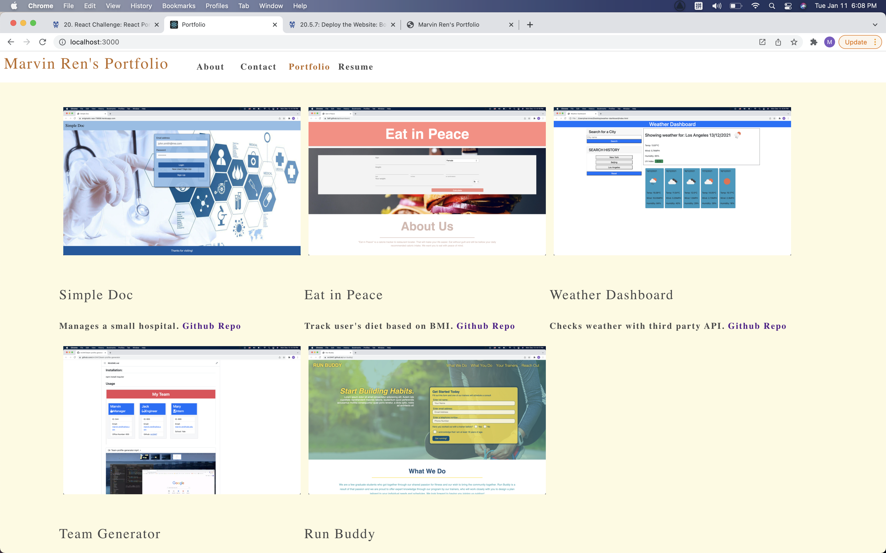

# Portfolio React
  ## Badges
  
  
  
  This App is open source software licensed as MIT.
  ## Table of Contents
  * [Description](#description)
  * [Installation](#installation)
  * [Usage](#usage)
  * [Credits](#Credits)
  * [Tests](#tests)
  * [Questions](#questions)
   * [Deployment](#deployment)
  ## Description: 
  My deployed React portfolio of work samples for potential employers to assess my candidacy for an open position.
  ## Installation: 
  npm start 
  Runs the app in the development mode.\
  Open [http://localhost:3000](http://localhost:3000) to view it in your browser.

  The page will reload when you make changes.\
  You may also see any lint errors in the console.
  ## Usage
  
  ## Credits 
  Marvin https://github.com/mr2447/portfolio-react
  ## Tests
  Launches the test runner in the interactive watch mode.\
  See the section about [running tests](https://facebook.github.io/create-react-app/docs/running-tests) for more information.
  ## Questions
  Reach me on gitHub or by email. 
  GitHub: mr2447
  Email: marvin.ren@yahoo.com
  ## Deployment
  This section has moved here: [https://mr2447.github.io/my-portfolio/](https://mr2447.github.io/portfolio-react/)# marvin-ren-portfolio
